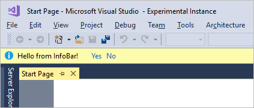
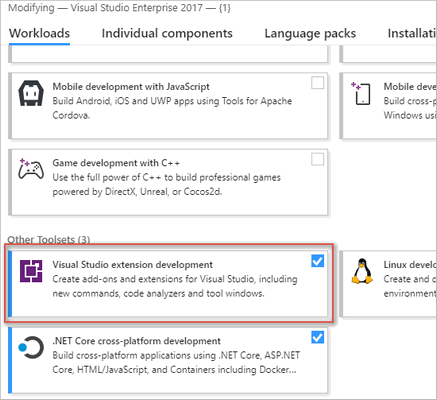
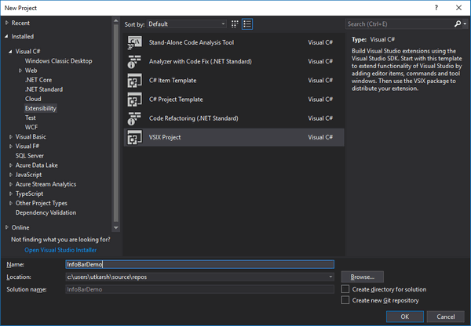
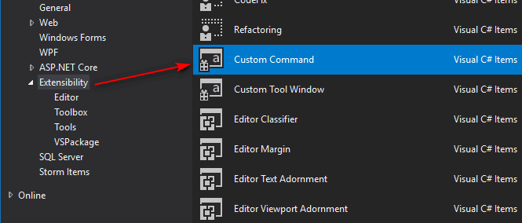
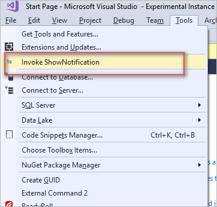
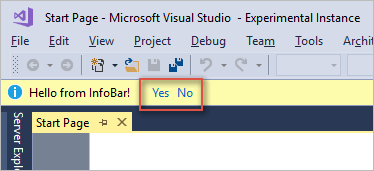
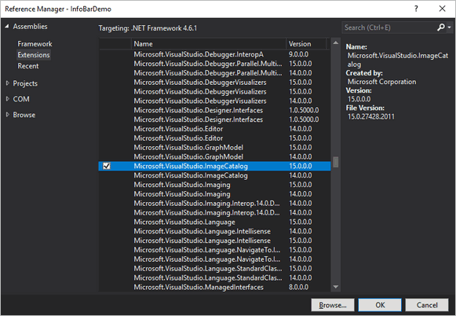


Wondering how Visual Studio displays important notifications on top of editor? Do you want to integrate notifications in your extension? This is demo extension to show how we can show notifications on top of the Visual Studio editor in Visual Studio 2017 using Visual Studio SDK. Not only we will create the notification using InfoBar, but we will also see how to add actions so that user's can click and take action.

Originally blogged at: https://www.visualstudiogeeks.com/extensions/how-to-show-notifications-inside-visual-studio-2017




## Prerequisites

You need two things to do Visual Studio extension development.

- Visual Studio 2017
- Visual Studio Extension development workload



> You can select extension development workload during install of VS 2017. If you have VS 2017 already, go to `Tools | Get tools and Features` inside Visual Studio and add this workload.

## Creating an extension project

Go to `File | New Project` and go to `Extensibility` and select `VSIX Project`.



This creates the basic template without any functionality. Next right click on the project and click `Add | New item` and then select `Custom Command` command.



This will create a VSIX package (deployable extension when compiled) with the code to add a menu item to `Tools` menu in Visual Studio. Based on the command name you decided, it will add the menu item with that name. I selected `Show Notification` as the command name so I got this when I run the extension by hitting `F5'.



On clicking the menu item, it currently displays a simple message box. You see it too? Great!

## Creating InfoBar and showing notifications

As you see in the screenshot, InfoBar can also have clickable actions (Yes/No for example) which users can interact with. 



### Create a InfoBarService

> _We will be separating out InfoBar related code in to its own class. I borrowed this idea from Microsoft's Mads Kristensen from one of his cool extensions in [GitHub](https://github.com/madskristensen/SolutionExtensions/blob/eaa08fec8d776070e296a4fac2ed74e7a4a6c5d6/src/Suggestions/InfoBarService.cs)._

Create a class named `InfoBarService.cs` and paste in the below code. 

```cs
class InfoBarService : IVsInfoBarUIEvents
{
    public void OnClosed(IVsInfoBarUIElement infoBarUIElement)
    {
        throw new NotImplementedException();
    }

    public void OnActionItemClicked(IVsInfoBarUIElement infoBarUIElement, IVsInfoBarActionItem actionItem)
    {
        throw new NotImplementedException();
    }
}
```

We have a class which implements `IVsInfoBarUIEvents` interface. This exposes `OnClosed` and `OnActionItemClicked` which are useful to handle the user actions. 

You will need to do two things to compile the above code successfully.

- Add `Microsoft.VisualStudio.Shell.Interop.14.0.DesignTime` nuget package.
- Add `using Microsoft.VisualStudio.Shell.Interop;` to `using` statements above the file.

Now we can start adding the InfoBar.

### Construct the InfoBar

Create a method named `ShowInfoBar` and insert the code below. 

```cs
var shell = _serviceProvider.GetService(typeof(SVsShell)) as IVsShell;
if (shell != null)
{
    // Get the main window handle to host our InfoBar
    shell.GetProperty((int) __VSSPROPID7.VSSPROPID_MainWindowInfoBarHost, out var obj);
    var host = (IVsInfoBarHost)obj;

    //If we cannot find the handle, we cannot do much, so return.
    if (host == null)
    {
        return;
    }

    //Construct the InfoBar text span object to host message  sent as a parameter
    InfoBarTextSpan text = new InfoBarTextSpan(message);

    //Create two hyperlinks so that user can take an action
    InfoBarHyperlink yes = new InfoBarHyperlink("Yes", "yes");
    InfoBarHyperlink no = new InfoBarHyperlink("No", "no");

    // Add the span and actions created above to InfoBarModel.
    // We would also like to show InfoBar as informational (KnwonMonikers.StatusInformation) and we would want it to show Close button.
    InfoBarTextSpan[] spans = new InfoBarTextSpan[] { text };
    InfoBarActionItem[] actions = new InfoBarActionItem[] { yes, no };
    InfoBarModel infoBarModel = new InfoBarModel(spans, actions, KnownMonikers.StatusInformation, isCloseButtonVisible: true);

    //Get the factory object from IVsInfoBarUIFactory, create it and add it to host.
    var factory = _serviceProvider.GetService(typeof(SVsInfoBarUIFactory)) as IVsInfoBarUIFactory;
    IVsInfoBarUIElement element = factory.CreateInfoBar(infoBarModel);
    element.Advise(this, out _cookie);
    host.AddInfoBar(element);
}
```

I have explained what we are doing in above code using the comments. **Note here though on how we get the handle to main window handler to host our InfoBar**. BTW, you will also need to add following `Microsoft.VisualStudio.Imaging` using statement. You need to reference `Microsoft.VisualStudio.ImageCatalog` assembly.



### Handle user interaction

Let's code to handle when user clicks on any of the options shown on the notification bar. We will also need to unsubscribe for the InfoBarEvents when the notification is closed.

```cs
public void OnClosed(IVsInfoBarUIElement infoBarUIElement)
{
    infoBarUIElement.Unadvise(_cookie);
}

public void OnActionItemClicked(IVsInfoBarUIElement infoBarUIElement, IVsInfoBarActionItem actionItem)
{
    string context = (string)actionItem.ActionContext;

    if (context == "yes")
    {
        MessageBox.Show("You clicked Yes!");
    }
    else
    {
        MessageBox.Show("You clicked No!");
    }
}
```

### Call the InfoBarService

We now need to replace the code to show the InfoBar when user clicks on our menu item from `Tools` menu. We do that with below code

```cs
// Initialize our service by passing ServiceProvider object which is our Package instance. 
// This is required to get the IVsShell service which we are using to get the main window host as shown in above code.
InfoBarService.Initialize(ServiceProvider);

// Pass the message to InfoBar.
InfoBarService.Instance.ShowInfoBar("Hello from InfoBar!");
```

## Guidelines in displaying the InfoBar notifications

Although it is easy way to get the user's attention by displaying such notifications, Microsoft recommends some general **Do's and Don't**s on using the InfoBar notifications.

More [here](https://docs.microsoft.com/en-us/visualstudio/extensibility/ux-guidelines/notifications-and-progress-for-visual-studio#appropriate-uses-for-an-infobar)

## Conclusion and Sample code

That's it! You now learnt a way to display notifications in the main window of the Visual Studio using the InfoBar. I hope you enjoyed this post! I have the complete sample on [GitHub](https://github.com/onlyutkarsh/InfoBarDemo).